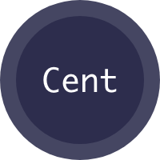

[![LinkedIn][linkedin-shield]][linkedin-url]

 

  

  <h3 align="center">Android MVVM Currency App with latest Arhitecture Compenents</h3>

  

    An application where I have implemented the technologies that I learned to practise more and more!
     
    <a href="play link">Download the Project</a>
    .

## Table of Contents

* [About the Project](#about-the-project)
  * [Built With](#built-with)
* [License](#license)
* [Contact](#contact)

## About The Project

[![Product Name Screen Shot][product-screenshot]]()

Cent gives you the ability to view all the currency rates by daily data based on a specific currency. When you first open up the application, you'll see all world currency rates against one currency. You could change this base currency on the top right base button. You could easily go to the detail of the selected currency and have the detailed data with a line chart in the intervals of last one week, one month, one year and five years.

While developing this project, I have used [Foreign exchange rates API](https://exchangeratesapi.io/) where I can retrieve the latest rates data based on the parameters such like; time interval, against to a base currency, with symbols(currency) and the data. The manipulation of the data made by me. I did some calculations that the API doesn't provide. 

Kotlin - Mvvm: get comfortable
Kotlin Coroutines for asynchronous programming
Retrofit for Http request
Gson
LiveData is used to communicate information back from ViewModel - Android Architecture
Koin - used to add dependencies to our classes

### Built With

While developing this project, I focused on using all the benefits of Kotlin and applying it by following the software architectural pattern:  MVVM. I tried to decrease the dependencies between my classes by applying Kotlin-Koin and for asynchronous programming I used Kotlin-Coroutines. After all, dealing with all this data, I used one of the android architecture component "LiveData" to make my application lifecycle aware. 

* [Coroutines](https://kotlinlang.org/docs/reference/coroutines-overview.html)
* [Koin](https://github.com/InsertKoinIO/koin)
* [LiveData](https://developer.android.com/topic/libraries/architecture/livedata)
* [Gson - Retrofit](https://square.github.io/retrofit/)

<!-- CONTACT -->
## Contact

Mehmet Taş - [@twitter](https://twitter.com/tasmehmet_) - m_tas@outlook.com

Project Link: [https://github.com/mehmettas/kotlin-mvvm-currency-app](https://github.com/mehmettas/kotlin-mvvm-currency-app)

Portfolio : [https://mehmettas.github.io/](https://mehmettas.github.io/)

LinkedIn : [https://www.linkedin.com/in/mehmettass/](https://www.linkedin.com/in/mehmettass/)

<!-- LICENSE -->
## License

    Copyright 2019 Mehmet Taş

    Licensed under the Apache License, Version 2.0 (the "License");
    you may not use this file except in compliance with the License.
    You may obtain a copy of the License at

        http://www.apache.org/licenses/LICENSE-2.0

    Unless required by applicable law or agreed to in writing, software
    distributed under the License is distributed on an "AS IS" BASIS,
    WITHOUT WARRANTIES OR CONDITIONS OF ANY KIND, either express or implied.
    See the License for the specific language governing permissions and
    limitations under the License.

<!-- MARKDOWN LINKS & IMAGES -->
<!-- https://www.markdownguide.org/basic-syntax/#reference-style-links -->
[contributors-shield]: https://img.shields.io/github/contributors/othneildrew/Best-README-Template.svg?style=flat-square
[contributors-url]: https://github.com/othneildrew/Best-README-Template/graphs/contributors
[forks-shield]: https://img.shields.io/github/forks/othneildrew/Best-README-Template.svg?style=flat-square
[forks-url]: https://github.com/othneildrew/Best-README-Template/network/members
[stars-shield]: https://img.shields.io/github/stars/othneildrew/Best-README-Template.svg?style=flat-square
[stars-url]: https://github.com/othneildrew/Best-README-Template/stargazers
[issues-shield]: https://img.shields.io/github/issues/othneildrew/Best-README-Template.svg?style=flat-square
[issues-url]: https://github.com/othneildrew/Best-README-Template/issues
[license-shield]: https://img.shields.io/github/license/othneildrew/Best-README-Template.svg?style=flat-square
[license-url]: https://github.com/othneildrew/Best-README-Template/blob/master/LICENSE.txt
[linkedin-shield]: https://img.shields.io/badge/-LinkedIn-black.svg?style=flat-square&logo=linkedin&colorB=555
[linkedin-url]: https://www.linkedin.com/in/mehmettass/
[product-screenshot]: images/screens.png
